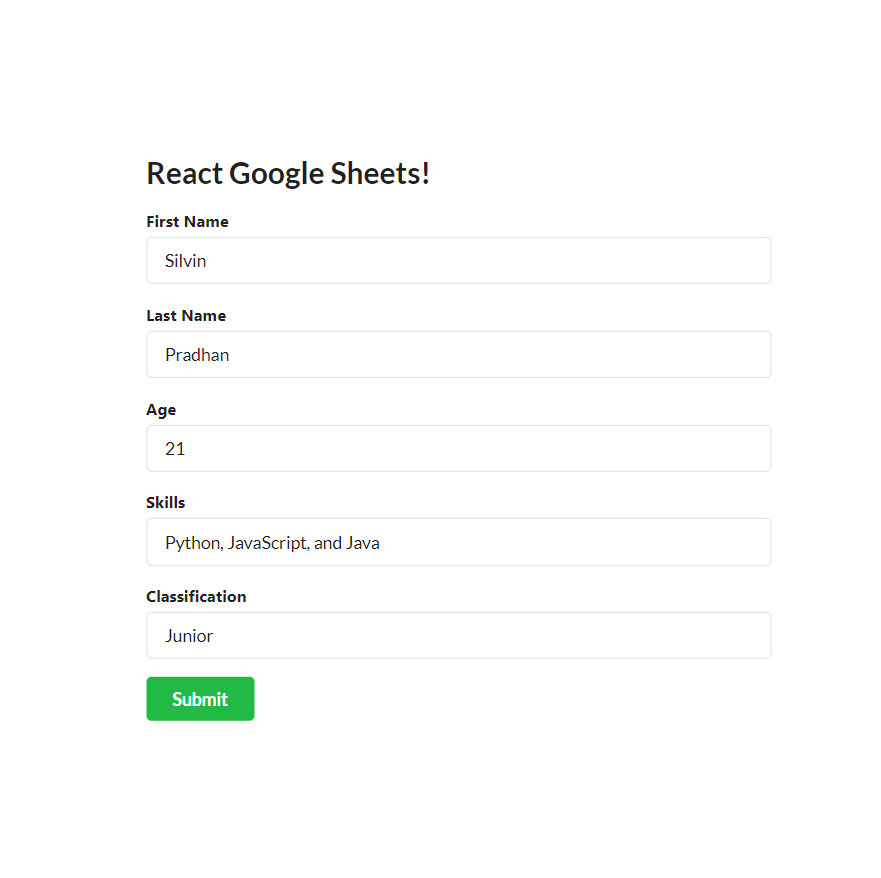
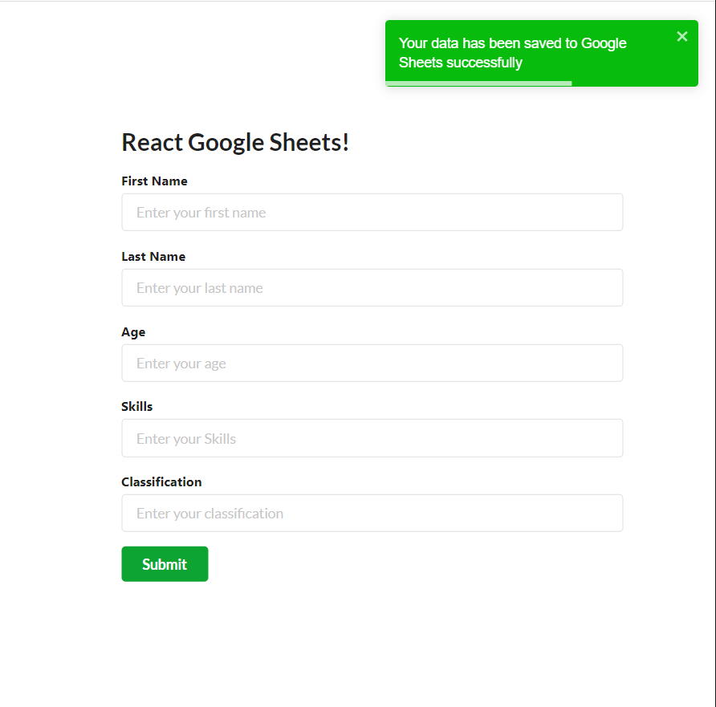
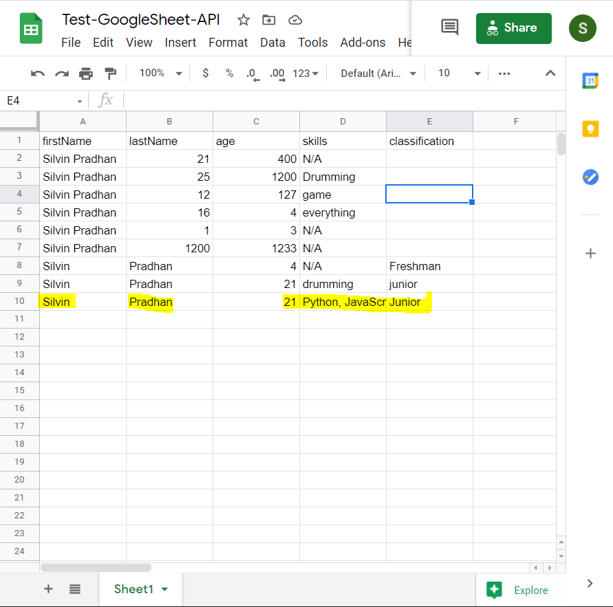

# React -REST API- Google SpreadSheet

1.  Clone the Repository

-   git clone https://github.com/SilvinPradhan/googleSheet2React.git test-GoogleSpreadsheet-api

2.  Install the required Packages

-   npm install
-   npm install semantic-ui-react semantic-ui-css

3.  Start the Application

-   npm start

## Demo

